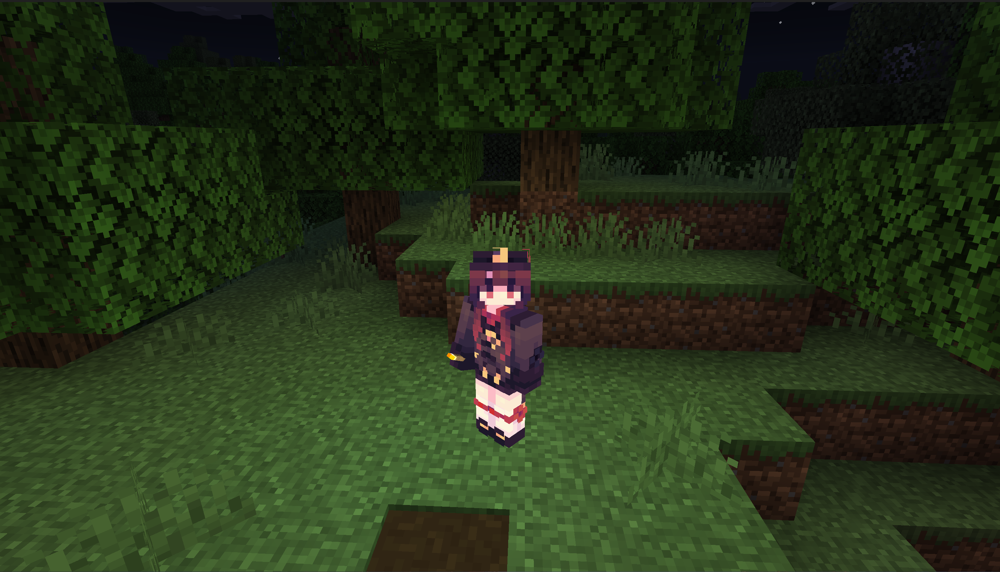
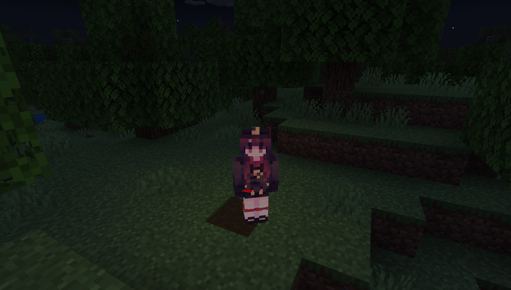
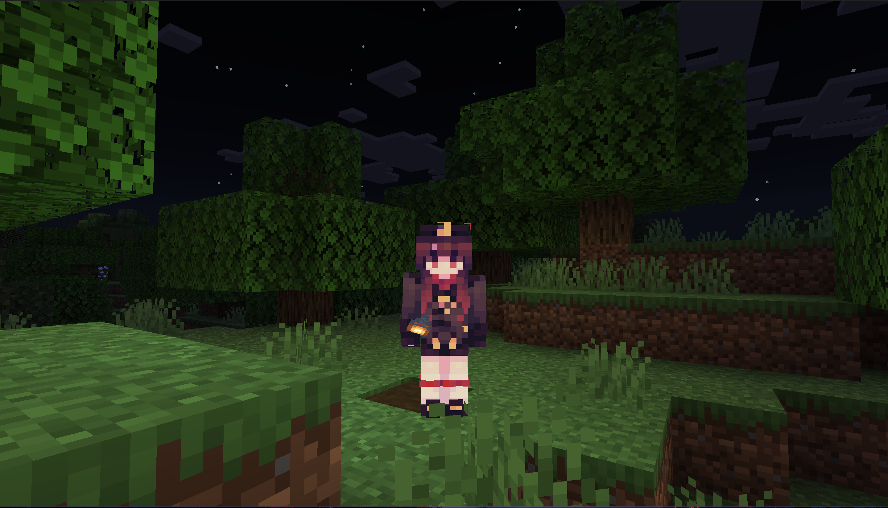

# 🔦 Flashlight Plugin for PowerNukkitX

A dynamic lighting solution that lets players illuminate their surroundings using various items! Perfect for cave explorations and nighttime adventures.


## Table of Contents
- [Features](#features)
- [Installation](#installation)
- [Configuration](#configuration)
- [Preview](#preview)
- [Contributing](#contributing)
- [License](#license)

## Features <a name="features"></a>
- **Item-Based Lighting** - Use any item as a light source
- **Custom Light Levels** - Configure brightness per item (0-15)
- **Dual Wield Support** - Works with both main hand and offhand
- **Smooth Updates** - Configurable refresh rate for optimal performance
- **Automatic Cleanup** - Removes light blocks when not needed
- **PowerNukkitX Optimized** - Built specifically for PNX's API

## Installation <a name="installation"></a>
1. Download latest `Flashlight.jar` from [Releases]()
2. Place in your server's `plugins/` folder
3. Restart server

## Configuration (`config.yml`) <a name="configuration"></a>
```yaml
# Main configuration file for Flashlight
# Some of these settings are safe, others can break your server if modified incorrectly
# New settings/defaults won't appear automatically in this file when upgrading.

# Flashlight update delay [float: seconds] (default: 0.25)
# It is recommended to be as high as possible. Lower = more CPU, check more often
update-delay: 0.25

# Light level of items [int] (min: 0, max: 15)
# It supports for set the light level of an item that is not automatically calculated (such as a lava bucket) or a custom items.
# Item name format is same as the item name of the /give command.
# example) lava_bucket (same as '325:10')
item-light-levels:
  'lava-bucket': 15
  #'nether_star': 10
```


## Preview <a name="preview"></a> 

[]()
[]()
[]()

## Contributing <a name="contributing"></a>

All kinds of contribution are welcome
- Send feedbacks.
- Submit bug reports.
- Write / Edit the documents.
- Fix bugs or add new features.

and if you found bug or have any issues please report them [here](https://github.com/pixelwhiz/Flashlight/issues/new)

## License <a name="license"></a>

This project is licensed under LGPL-3.0. Please see [LICENSE](LICENSE) file for details.